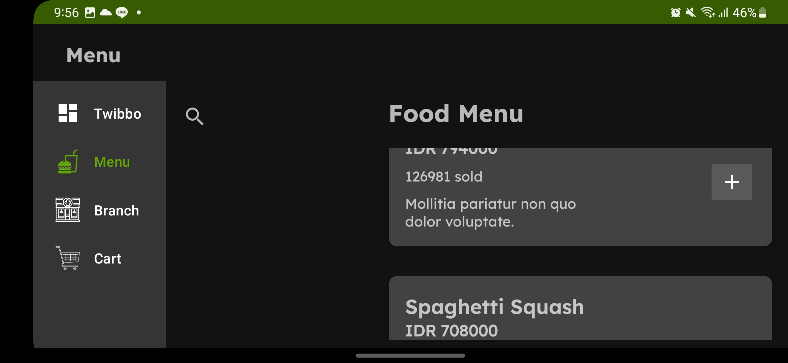
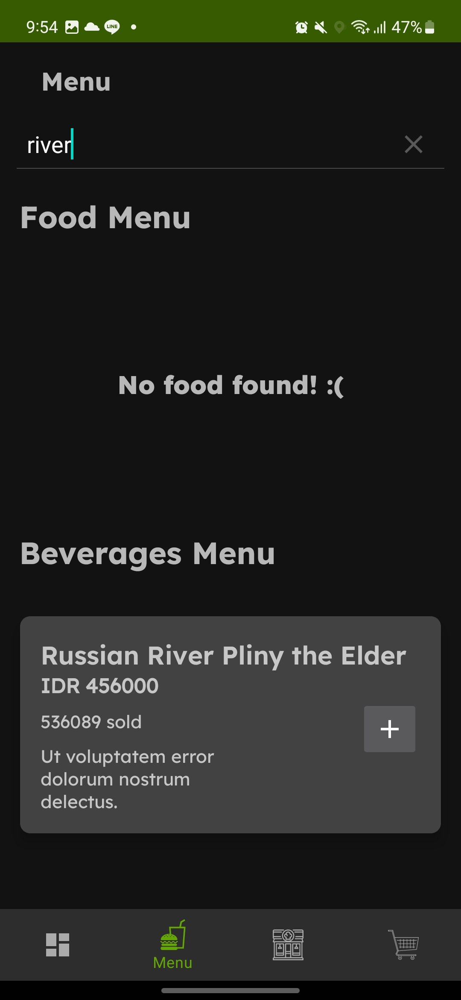
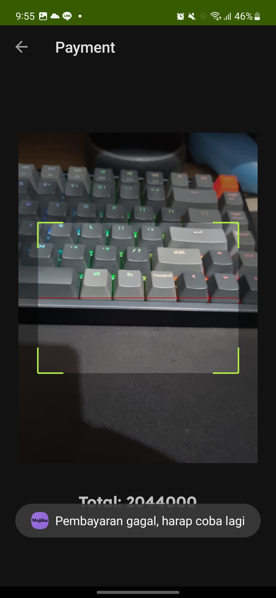
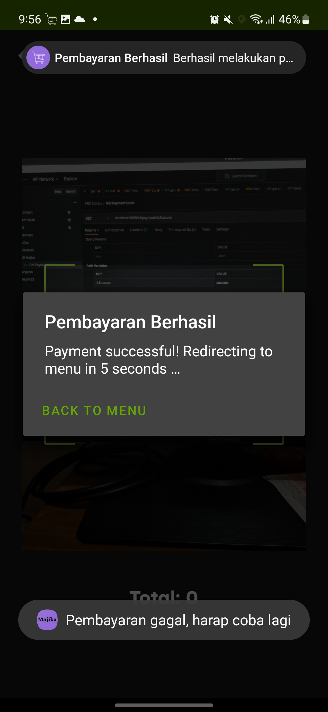

# Tugas Besar PBD Android

## Deskripsi

Aplikasi ini adalah aplikasi untuk platform android yang berfungsi untuk membeli makanan dan minuman di sebuah restoran. Aplikasi ini bisa melakukan pembayaran dengan menggunakan QR Code. Selain itu, terdapat halaman untuk menampilkan menu makanan dan minuman yang tersedia di restoran dan cabang restoran. Terdapat fitur foto menggunakan twibbon.

## Library

1. ZXing
2. Retrofit
3. Gson
4. Room
5. Kotlin Coroutines

## Screenshots

<!-- Attach all screenshots from the folder screenshot with a title -->

1.  `Branches`
    
2.  `Cart`
    
3.  `Menu`
    
4.  `Menu2`
    
5.  `Menu-Landscape`
    
6.  `Menu-Filtered`
    
7.  `Payment`
    
8.  `Payment-Failed`
    
9.  `Payment-Success`
    
10. `Twibbon`
    

## Pembagian Kerja

|          Nama          |   NIM    |                   Tugas                    |
| :--------------------: | :------: | :----------------------------------------: |
| Aditya Prawira Nugroho | 13520049 |        Cart, Payment, Room database        |
| Christopher Jeffrey K. | 13520055 |             Twibbon, responsif             |
| Owen Christian Wijaya  | 13520124 | Setup, Retrofit, Menu, Branch, ZXing setup |
