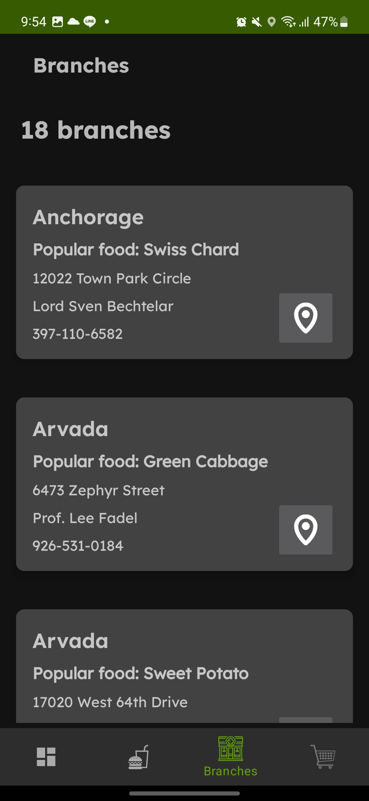

# Majika: Aplikasi Android untuk Pemesanan Makanan
>Implementasi untuk Tugas Besar 1 IF3210 Pengembangan Aplikasi berbasis _Platform_ Prodi Informatika ITB Tahun Ajaran 2022 / 2023

## Deskripsi

Aplikasi ini adalah aplikasi untuk platform android yang berfungsi untuk membeli makanan dan minuman di sebuah restoran. Aplikasi ini bisa melakukan pembayaran dengan menggunakan QR Code. Selain itu, terdapat halaman untuk menampilkan menu makanan dan minuman yang tersedia di restoran dan cabang restoran. Terdapat fitur foto menggunakan twibbon.

## Library

1. **ZXing**: _library_ untuk _QR scanner_
2. **Retrofit**: _library_ untuk melakukan HTTP GET/POST _request_ pada _backend_
3. **Room**: _library_ untuk membuat _database instance_ dan interaksi dengan _database_ pada fitur keranjang 
4. Kotlin Coroutines: _library_ untuk melakukan _asynchronous tasks_

## Screenshots

<!-- Attach all screenshots from the folder screenshot with a title -->

<table>
    <tbody>
        <tr>
            <td>Halaman Branches      </td>
            <td>Halaman Cart     </td>
        </tr>
        <tr>
            <td>Halaman Menu (1)      </td>
            <td>Halaman Menu (2)     </td>
        </tr>
        <tr>
            <td>Halaman Menu (Setelah Filter)      </td>
            <td>Halaman Menu (Dengan Sensor Temperatur)     </td>
        </tr>
        <tr>
            <td colspan="2">Halaman Menu (Landscape)     </td>
        </tr>
        <tr>
            <td>Halaman Twibbon      </td>
            <td>Halaman Payment     </td>
        </tr>
        <tr>
            <td>Halaman Pembayaran Sukses      </td>
            <td>Halaman Pembayaran Gagal     </td>
        </tr>
    </tbody>
</table>

## Pembagian Kerja

<table>
    <thead>
        <tr>
            <th>Nama</th>
            <th>NIM</th>
            <th>Jumlah Jam Persiapan</th>
            <th>Jumlah Jam Pengerjaan</th>
            <th>Tugas</th>
        </tr>
    </thead>
    <tbody>
        <tr>
            <td>Aditya Prawira Nugroho</td>
            <td>13520049</td>
            <td>10 jam</td>
            <td>21 jam</td>
            <td>
                <ul>
                    <li>Membuat fitur <i>cart</i> beserta integrasi ke menu</li>
                    <li><i>Setup Room Database</i> menggunakan <i>Repository Pattern</i></li>
                    <li><i>Membuat fitur pembayaran menggunakan QR scanner + <i>error handler</i>
                    <li>Melakukan perbaikan <i>theme + color palette</i>
                </ul>
            </td>
        </tr>
        <tr>
            <td>Christopher Jeffrey Kunadjaja</td>
            <td>13520055</td>
            <td>8 jam</td>
            <td>20 jam</td>
            <td>
                <ul>
                    <li>Membuat fitur <i>twibbon</i></li>
                    <li>Membuat halaman <i>responsive</i> untuk semua halaman</li>
                </ul>
            </td>
        </tr>
        <tr>
            <td>Owen Christian Wijaya</td>
            <td>13520124</td>
            <td>8 jam</td>
            <td>23 jam</td>
            <td>
                <ul>
                    <li>Melakukan <i>setup</i> awal</li>
                    <li>Melakukan <i>setup Retrofit client</i></li>
                    <li>Membuat fitur <i>branch</i> dan <i>menu</i> beserta integrasi ke <i>cart</i></li>
                    <li>Perbaikan tampilan UI + <i>error handler</i></i>
                </ul>
            </td>
        </tr>
    </tbody>
</table>

